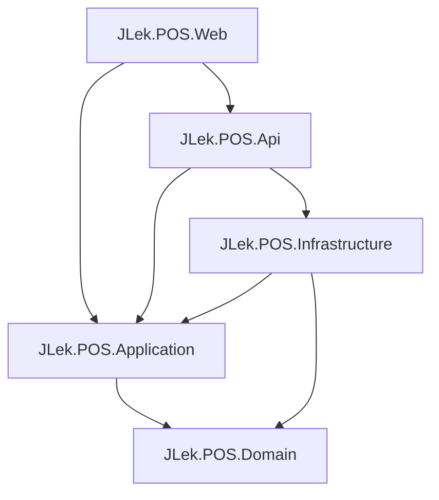
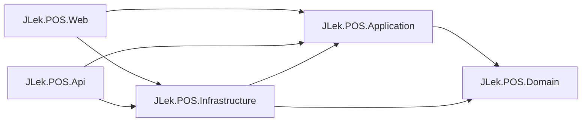
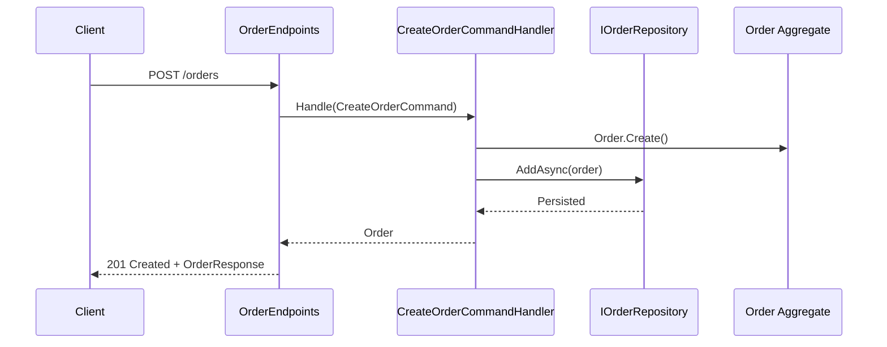
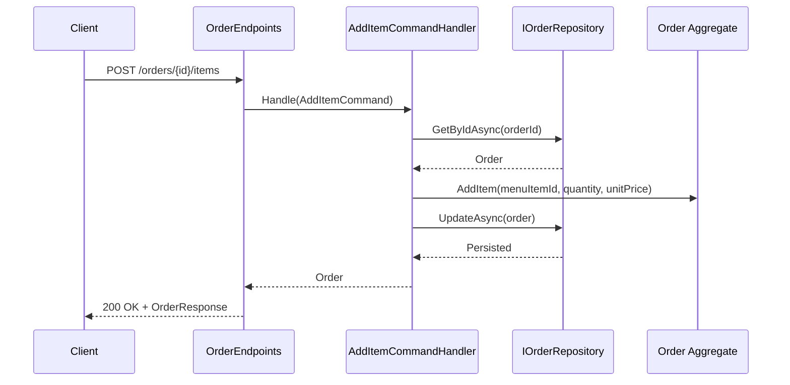
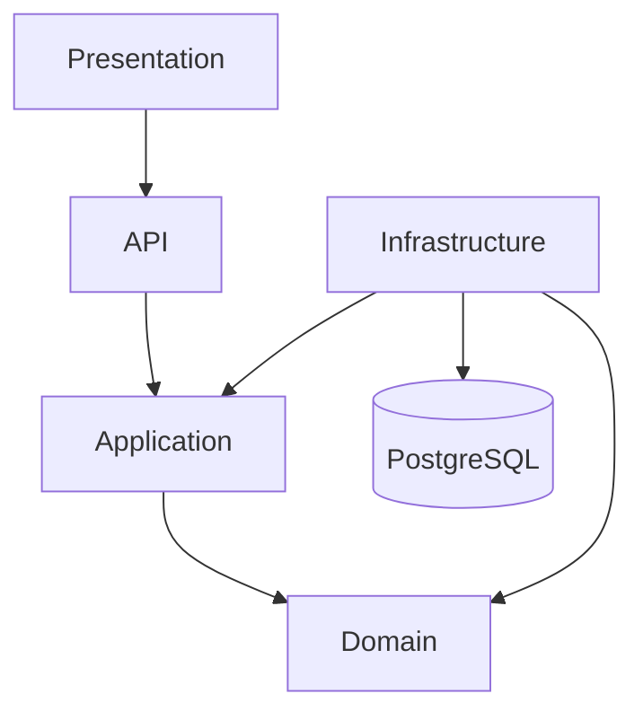
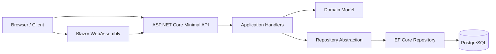

# JLek POS Software Architecture Handbook

Generated from verified repository evidence as of 2026-07-13.

## Scope and verification basis

This handbook is based only on verified repository evidence from:

- Solution file: [JLek.POS.sln](../JLek.POS.sln)
- Source files under [src](../src)
- Architecture and dependency documentation in [docs/06-technical/architecture.md](06-technical/architecture.md) and [docs/06-technical/dependency-rules.md](06-technical/dependency-rules.md)
- Project status and AI context in [docs/97-AI-Docs/98-ai-context.md](97-AI-Docs/98-ai-context.md) and [docs/97-AI-Docs/99-project-status.md](97-AI-Docs/99-project-status.md)

The current source set contains 69 C# source files under [src](../src).

---

## 1. Architecture summary

The repository implements a Clean Architecture + DDD + CQRS style solution for a restaurant POS system.

### Architectural style

- Presentation: minimal web client and API host
- API: HTTP boundary for orders
- Application: use-case orchestration and CQRS handlers
- Domain: aggregates, entities, value objects, rules, and domain events
- Infrastructure: EF Core, PostgreSQL, repository implementations, persistence configuration

### Documented dependency direction

Dependencies point inward, from presentation and infrastructure toward the domain.

---

## 2. Layer-by-layer explanation

### 2.1 Presentation layer

Projects:

- [src/JLek.POS.Web/JLek.POS.Web.csproj](../src/JLek.POS.Web/JLek.POS.Web.csproj)

Responsibilities:

- Provides the web client entrypoint.
- Configures a Blazor WebAssembly host.
- Registers an HttpClient for API access.

Verified implementation:

- [src/JLek.POS.Web/Program.cs](../src/JLek.POS.Web/Program.cs)

### 2.2 API layer

Projects:

- [src/JLek.POS.Api/JLek.POS.Api.csproj](../src/JLek.POS.Api/JLek.POS.Api.csproj)

Responsibilities:

- Hosts the HTTP API using ASP.NET Core minimal APIs.
- Exposes order endpoints.
- Maps application handlers to HTTP requests.
- Returns response DTOs.

Verified implementation:

- [src/JLek.POS.Api/Program.cs](../src/JLek.POS.Api/Program.cs)
- [src/JLek.POS.Api/Endpoints/OrderEndpoints.cs](../src/JLek.POS.Api/Endpoints/OrderEndpoints.cs)

### 2.3 Application layer

Projects:

- [src/JLek.POS.Application/JLek.POS.Application.csproj](../src/JLek.POS.Application/JLek.POS.Application.csproj)

Responsibilities:

- Contains CQRS command and query handlers.
- Coordinates the execution of use cases.
- Depends on repository abstractions and the domain layer.

Verified implementation:

- [src/JLek.POS.Application/DependencyInjection.cs](../src/JLek.POS.Application/DependencyInjection.cs)
- [src/JLek.POS.Application/Abstractions](../src/JLek.POS.Application/Abstractions)
- [src/JLek.POS.Application/Features/Orders](../src/JLek.POS.Application/Features/Orders)

### 2.4 Domain layer

Projects:

- [src/JLek.POS.Domain/JLek.POS.Domain.csproj](../src/JLek.POS.Domain/JLek.POS.Domain.csproj)

Responsibilities:

- Contains the business model.
- Owns aggregates, entities, value objects, domain events, and business rules.
- Enforces invariants through rules and aggregate methods.

Verified implementation:

- [src/JLek.POS.Domain/Orders](../src/JLek.POS.Domain/Orders)
- [src/JLek.POS.Domain/Common](../src/JLek.POS.Domain/Common)

### 2.5 Infrastructure layer

Projects:

- [src/JLek.POS.Infrastructure/JLek.POS.Infrastructure.csproj](../src/JLek.POS.Infrastructure/JLek.POS.Infrastructure.csproj)

Responsibilities:

- Implements persistence and repository contracts.
- Configures EF Core and PostgreSQL.
- Maps domain aggregates to database tables.

Verified implementation:

- [src/JLek.POS.Infrastructure/DependencyInjection.cs](../src/JLek.POS.Infrastructure/DependencyInjection.cs)
- [src/JLek.POS.Infrastructure/Repositories/OrderRepository.cs](../src/JLek.POS.Infrastructure/Repositories/OrderRepository.cs)
- [src/JLek.POS.Infrastructure/Persistence](../src/JLek.POS.Infrastructure/Persistence)

### 2.6 Database layer

The implementation uses PostgreSQL with EF Core migrations.

Verified implementation:

- [src/JLek.POS.Infrastructure/Migrations/20260711111159_InitialCreate.cs](../src/JLek.POS.Infrastructure/Migrations/20260711111159_InitialCreate.cs)

---

## 3. Every project

| Project                                                                                                                     | Role                                     | Verified evidence                                                              |
| --------------------------------------------------------------------------------------------------------------------------- | ---------------------------------------- | ------------------------------------------------------------------------------ |
| [src/JLek.POS.Domain/JLek.POS.Domain.csproj](../src/JLek.POS.Domain/JLek.POS.Domain.csproj)                                 | Domain model and business rules          | Domain entities, aggregates, value objects, events, rules                      |
| [src/JLek.POS.Application/JLek.POS.Application.csproj](../src/JLek.POS.Application/JLek.POS.Application.csproj)             | Use-case orchestration and CQRS handlers | Command/query handlers and repository abstractions                             |
| [src/JLek.POS.Infrastructure/JLek.POS.Infrastructure.csproj](../src/JLek.POS.Infrastructure/JLek.POS.Infrastructure.csproj) | EF Core and repository implementation    | Repository, DbContext, migrations, converters                                  |
| [src/JLek.POS.Api/JLek.POS.Api.csproj](../src/JLek.POS.Api/JLek.POS.Api.csproj)                                             | HTTP API host                            | Minimal API endpoints and request/response DTOs                                |
| [src/JLek.POS.Web/JLek.POS.Web.csproj](../src/JLek.POS.Web/JLek.POS.Web.csproj)                                             | Web client                               | Blazor WebAssembly host                                                        |
| [src/JLek.POS.Shared/JLek.POS.Shared.csproj](../src/JLek.POS.Shared/JLek.POS.Shared.csproj)                                 | Shared project container                 | Present in solution, no source files were verified in this repository snapshot |

---

## 4. Every namespace

| Namespace                                                   | Project        | Verified types                                                   |
| ----------------------------------------------------------- | -------------- | ---------------------------------------------------------------- |
| JLek.POS.Api                                                | API            | OrderEndpoints                                                   |
| JLek.POS.Api.Endpoints                                      | API            | OrderEndpoints                                                   |
| JLek.POS.Api.Requests                                       | API            | CreateOrderRequest, AddItemRequest, RemoveItemRequest            |
| JLek.POS.Api.Responses                                      | API            | OrderResponse, OrderResponseMappings                             |
| JLek.POS.Application                                        | Application    | DependencyInjection                                              |
| JLek.POS.Application.Abstractions                           | Application    | ICommand, ICommandHandler, IQuery, IQueryHandler                 |
| JLek.POS.Application.Abstractions.Repositories              | Application    | IOrderRepository                                                 |
| JLek.POS.Application.Features.Orders.Commands.CreateOrder   | Application    | CreateOrderCommand, CreateOrderCommandHandler                    |
| JLek.POS.Application.Features.Orders.Commands.AddItem       | Application    | AddItemCommand, AddItemCommandHandler                            |
| JLek.POS.Application.Features.Orders.Commands.RemoveItem    | Application    | RemoveItemCommand, RemoveItemCommandHandler                      |
| JLek.POS.Application.Features.Orders.Commands.ConfirmOrder  | Application    | ConfirmOrderCommand, ConfirmOrderCommandHandler                  |
| JLek.POS.Application.Features.Orders.Commands.CompleteOrder | Application    | CompleteOrderCommand, CompleteOrderCommandHandler                |
| JLek.POS.Application.Features.Orders.Queries.GetOrderById   | Application    | GetOrderByIdQuery, GetOrderByIdQueryHandler                      |
| JLek.POS.Application.Features.Orders.Queries.GetOrders      | Application    | GetOrdersQuery, GetOrdersQueryHandler                            |
| JLek.POS.Domain.Orders                                      | Domain         | Order, OrderItem, OrderSession, OrderStatus                      |
| JLek.POS.Domain.Orders.ValueObjects                         | Domain         | OrderId, OrderItemId, OrderSessionId                             |
| JLek.POS.Domain.Orders.Rules                                | Domain         | Business rules                                                   |
| JLek.POS.Domain.Orders.Events                               | Domain         | Domain events                                                    |
| JLek.POS.Domain.Common.Primitives                           | Domain         | AggregateRoot, Entity, ValueObject, DomainEvent, IDomainEvent    |
| JLek.POS.Domain.Common.Rules                                | Domain         | IBusinessRule, BusinessRuleValidationException                   |
| JLek.POS.Domain.Common.Results                              | Domain         | Result, ResultT, Error                                           |
| JLek.POS.Domain.Common.ValueObjects                         | Domain         | Money, Quantity                                                  |
| JLek.POS.Domain.ValueObjects                                | Domain         | MenuId, TableId, PaymentId                                       |
| JLek.POS.Infrastructure                                     | Infrastructure | DependencyInjection                                              |
| JLek.POS.Infrastructure.Persistence                         | Infrastructure | ApplicationDbContext                                             |
| JLek.POS.Infrastructure.Persistence.Configurations          | Infrastructure | OrderConfiguration, OrderItemConfiguration                       |
| JLek.POS.Infrastructure.Persistence.Converters              | Infrastructure | OrderIdConverter, OrderItemIdConverter, StronglyTypedIdConverter |
| JLek.POS.Infrastructure.Repositories                        | Infrastructure | OrderRepository                                                  |
| JLek.POS.Infrastructure.Migrations                          | Infrastructure | InitialCreate                                                    |
| JLek.POS.Web                                                | Web            | Program                                                          |

---

## 5. Every public type

| Namespace                                                   | Type                                | Kind           | Evidence                                                                                                                                                                                            |
| ----------------------------------------------------------- | ----------------------------------- | -------------- | --------------------------------------------------------------------------------------------------------------------------------------------------------------------------------------------------- |
| JLek.POS.Api.Endpoints                                      | OrderEndpoints                      | static class   | [src/JLek.POS.Api/Endpoints/OrderEndpoints.cs](../src/JLek.POS.Api/Endpoints/OrderEndpoints.cs)                                                                                                     |
| JLek.POS.Api.Responses                                      | OrderResponse                       | record         | [src/JLek.POS.Api/Responses/OrderResponse.cs](../src/JLek.POS.Api/Responses/OrderResponse.cs)                                                                                                       |
| JLek.POS.Api.Responses                                      | OrderResponseMappings               | static class   | [src/JLek.POS.Api/Responses/OrderResponseMappings.cs](../src/JLek.POS.Api/Responses/OrderResponseMappings.cs)                                                                                       |
| JLek.POS.Api.Requests                                       | CreateOrderRequest                  | record         | [src/JLek.POS.Api/Requests/CreateOrderRequest.cs](../src/JLek.POS.Api/Requests/CreateOrderRequest.cs)                                                                                               |
| JLek.POS.Api.Requests                                       | AddItemRequest                      | record         | [src/JLek.POS.Api/Requests/AddItemRequest.cs](../src/JLek.POS.Api/Requests/AddItemRequest.cs)                                                                                                       |
| JLek.POS.Api.Requests                                       | RemoveItemRequest                   | record         | [src/JLek.POS.Api/Requests/RemoveItemRequest.cs](../src/JLek.POS.Api/Requests/RemoveItemRequest.cs)                                                                                                 |
| JLek.POS.Application                                        | DependencyInjection                 | static class   | [src/JLek.POS.Application/DependencyInjection.cs](../src/JLek.POS.Application/DependencyInjection.cs)                                                                                               |
| JLek.POS.Application.Abstractions                           | ICommand                            | interface      | [src/JLek.POS.Application/Abstractions/ICommand.cs](../src/JLek.POS.Application/Abstractions/ICommand.cs)                                                                                           |
| JLek.POS.Application.Abstractions                           | ICommandHandler<TCommand>           | interface      | [src/JLek.POS.Application/Abstractions/ICommandHandler.cs](../src/JLek.POS.Application/Abstractions/ICommandHandler.cs)                                                                             |
| JLek.POS.Application.Abstractions                           | IQuery<TResult>                     | interface      | [src/JLek.POS.Application/Abstractions/IQuery.cs](../src/JLek.POS.Application/Abstractions/IQuery.cs)                                                                                               |
| JLek.POS.Application.Abstractions                           | IQueryHandler<TQuery,TResult>       | interface      | [src/JLek.POS.Application/Abstractions/IQueryHandler.cs](../src/JLek.POS.Application/Abstractions/IQueryHandler.cs)                                                                                 |
| JLek.POS.Application.Abstractions.Repositories              | IOrderRepository                    | interface      | [src/JLek.POS.Application/Abstractions/Repositories/IOrderRepository.cs](../src/JLek.POS.Application/Abstractions/Repositories/IOrderRepository.cs)                                                 |
| JLek.POS.Application.Features.Orders.Commands.CreateOrder   | CreateOrderCommand                  | record         | [src/JLek.POS.Application/Features/Orders/Commands/CreateOrder/CreateOrderCommand.cs](../src/JLek.POS.Application/Features/Orders/Commands/CreateOrder/CreateOrderCommand.cs)                       |
| JLek.POS.Application.Features.Orders.Commands.CreateOrder   | CreateOrderCommandHandler           | class          | [src/JLek.POS.Application/Features/Orders/Commands/CreateOrder/CreateOrderCommandHandler.cs](../src/JLek.POS.Application/Features/Orders/Commands/CreateOrder/CreateOrderCommandHandler.cs)         |
| JLek.POS.Application.Features.Orders.Commands.AddItem       | AddItemCommand                      | record         | [src/JLek.POS.Application/Features/Orders/Commands/AddItem/AddItemCommand.cs](../src/JLek.POS.Application/Features/Orders/Commands/AddItem/AddItemCommand.cs)                                       |
| JLek.POS.Application.Features.Orders.Commands.AddItem       | AddItemCommandHandler               | class          | [src/JLek.POS.Application/Features/Orders/Commands/AddItem/AddItemCommandHandler.cs](../src/JLek.POS.Application/Features/Orders/Commands/AddItem/AddItemCommandHandler.cs)                         |
| JLek.POS.Application.Features.Orders.Commands.RemoveItem    | RemoveItemCommand                   | record         | [src/JLek.POS.Application/Features/Orders/Commands/RemoveItem/RemoveItemCommand.cs](../src/JLek.POS.Application/Features/Orders/Commands/RemoveItem/RemoveItemCommand.cs)                           |
| JLek.POS.Application.Features.Orders.Commands.RemoveItem    | RemoveItemCommandHandler            | class          | [src/JLek.POS.Application/Features/Orders/Commands/RemoveItem/RemoveItemCommandHandler.cs](../src/JLek.POS.Application/Features/Orders/Commands/RemoveItem/RemoveItemCommandHandler.cs)             |
| JLek.POS.Application.Features.Orders.Commands.ConfirmOrder  | ConfirmOrderCommand                 | record         | [src/JLek.POS.Application/Features/Orders/Commands/ConfirmOrder/ConfirmOrderCommand.cs](../src/JLek.POS.Application/Features/Orders/Commands/ConfirmOrder/ConfirmOrderCommand.cs)                   |
| JLek.POS.Application.Features.Orders.Commands.ConfirmOrder  | ConfirmOrderCommandHandler          | class          | [src/JLek.POS.Application/Features/Orders/Commands/ConfirmOrder/ConfirmOrderCommandHandler.cs](../src/JLek.POS.Application/Features/Orders/Commands/ConfirmOrder/ConfirmOrderCommandHandler.cs)     |
| JLek.POS.Application.Features.Orders.Commands.CompleteOrder | CompleteOrderCommand                | record         | [src/JLek.POS.Application/Features/Orders/Commands/CompleteOrder/CompleteOrderCommand.cs](../src/JLek.POS.Application/Features/Orders/Commands/CompleteOrder/CompleteOrderCommand.cs)               |
| JLek.POS.Application.Features.Orders.Commands.CompleteOrder | CompleteOrderCommandHandler         | class          | [src/JLek.POS.Application/Features/Orders/Commands/CompleteOrder/CompleteOrderCommandHandler.cs](../src/JLek.POS.Application/Features/Orders/Commands/CompleteOrder/CompleteOrderCommandHandler.cs) |
| JLek.POS.Application.Features.Orders.Queries.GetOrderById   | GetOrderByIdQuery                   | record         | [src/JLek.POS.Application/Features/Orders/Queries/GetOrderById/GetOrderByIdQuery.cs](../src/JLek.POS.Application/Features/Orders/Queries/GetOrderById/GetOrderByIdQuery.cs)                         |
| JLek.POS.Application.Features.Orders.Queries.GetOrderById   | GetOrderByIdQueryHandler            | class          | [src/JLek.POS.Application/Features/Orders/Queries/GetOrderById/GetOrderByIdQueryHandler.cs](../src/JLek.POS.Application/Features/Orders/Queries/GetOrderById/GetOrderByIdQueryHandler.cs)           |
| JLek.POS.Application.Features.Orders.Queries.GetOrders      | GetOrdersQuery                      | record         | [src/JLek.POS.Application/Features/Orders/Queries/GetOrders/GetOrdersQuery.cs](../src/JLek.POS.Application/Features/Orders/Queries/GetOrders/GetOrdersQuery.cs)                                     |
| JLek.POS.Application.Features.Orders.Queries.GetOrders      | GetOrdersQueryHandler               | class          | [src/JLek.POS.Application/Features/Orders/Queries/GetOrders/GetOrdersQueryHandler.cs](../src/JLek.POS.Application/Features/Orders/Queries/GetOrders/GetOrdersQueryHandler.cs)                       |
| JLek.POS.Domain.Orders                                      | Order                               | class          | [src/JLek.POS.Domain/Orders/Order.cs](../src/JLek.POS.Domain/Orders/Order.cs)                                                                                                                       |
| JLek.POS.Domain.Orders                                      | OrderItem                           | class          | [src/JLek.POS.Domain/Orders/OrderItem.cs](../src/JLek.POS.Domain/Orders/OrderItem.cs)                                                                                                               |
| JLek.POS.Domain.Orders                                      | OrderSession                        | class          | [src/JLek.POS.Domain/Orders/OrderSession.cs](../src/JLek.POS.Domain/Orders/OrderSession.cs)                                                                                                         |
| JLek.POS.Domain.Orders                                      | OrderStatus                         | enum           | [src/JLek.POS.Domain/Orders/OrderStatus.cs](../src/JLek.POS.Domain/Orders/OrderStatus.cs)                                                                                                           |
| JLek.POS.Domain.Orders.ValueObjects                         | OrderId                             | class          | [src/JLek.POS.Domain/Orders/ValueObjects/OrderId.cs](../src/JLek.POS.Domain/Orders/ValueObjects/OrderId.cs)                                                                                         |
| JLek.POS.Domain.Orders.ValueObjects                         | OrderItemId                         | class          | [src/JLek.POS.Domain/Orders/ValueObjects/OrderItemId.cs](../src/JLek.POS.Domain/Orders/ValueObjects/OrderItemId.cs)                                                                                 |
| JLek.POS.Domain.Orders.ValueObjects                         | OrderSessionId                      | record         | [src/JLek.POS.Domain/Orders/ValueObjects/OrderSessionId.cs](../src/JLek.POS.Domain/Orders/ValueObjects/OrderSessionId.cs)                                                                           |
| JLek.POS.Domain.Orders.Events                               | OrderCreatedEvent                   | class          | [src/JLek.POS.Domain/Orders/Events/OrderCreatedEvent.cs](../src/JLek.POS.Domain/Orders/Events/OrderCreatedEvent.cs)                                                                                 |
| JLek.POS.Domain.Orders.Events                               | OrderConfirmedEvent                 | class          | [src/JLek.POS.Domain/Orders/Events/OrderConfirmedEvent.cs](../src/JLek.POS.Domain/Orders/Events/OrderConfirmedEvent.cs)                                                                             |
| JLek.POS.Domain.Orders.Events                               | OrderCompletedEvent                 | class          | [src/JLek.POS.Domain/Orders/Events/OrderCompletedEvent.cs](../src/JLek.POS.Domain/Orders/Events/OrderCompletedEvent.cs)                                                                             |
| JLek.POS.Domain.Orders.Rules                                | CannotConfirmNonDraftOrderRule      | class          | [src/JLek.POS.Domain/Orders/Rules/CannotConfirmNonDraftOrderRule.cs](../src/JLek.POS.Domain/Orders/Rules/CannotConfirmNonDraftOrderRule.cs)                                                         |
| JLek.POS.Domain.Orders.Rules                                | CannotConfirmEmptyOrderRule         | class          | [src/JLek.POS.Domain/Orders/Rules/CannotConfirmEmptyOrderRule.cs](../src/JLek.POS.Domain/Orders/Rules/CannotConfirmEmptyOrderRule.cs)                                                               |
| JLek.POS.Domain.Orders.Rules                                | CannotCompleteNonConfirmedOrderRule | class          | [src/JLek.POS.Domain/Orders/Rules/CannotCompleteNonConfirmedOrderRule.cs](../src/JLek.POS.Domain/Orders/Rules/CannotCompleteNonConfirmedOrderRule.cs)                                               |
| JLek.POS.Domain.Orders.Rules                                | CannotModifyCancelledOrderRule      | class          | [src/JLek.POS.Domain/Orders/Rules/CannotModifyCancelledOrderRule.cs](../src/JLek.POS.Domain/Orders/Rules/CannotModifyCancelledOrderRule.cs)                                                         |
| JLek.POS.Domain.Orders.Rules                                | CannotModifyConfirmedOrderRule      | class          | [src/JLek.POS.Domain/Orders/Rules/CannotModifyConfirmedOrderRule.cs](../src/JLek.POS.Domain/Orders/Rules/CannotModifyConfirmedOrderRule.cs)                                                         |
| JLek.POS.Domain.Common.Primitives                           | AggregateRoot<TId>                  | abstract class | [src/JLek.POS.Domain/Common/Primitives/AggregateRoot.cs](../src/JLek.POS.Domain/Common/Primitives/AggregateRoot.cs)                                                                                 |
| JLek.POS.Domain.Common.Primitives                           | Entity<TId>                         | abstract class | [src/JLek.POS.Domain/Common/Primitives/Entity.cs](../src/JLek.POS.Domain/Common/Primitives/Entity.cs)                                                                                               |
| JLek.POS.Domain.Common.Primitives                           | ValueObject                         | abstract class | [src/JLek.POS.Domain/Common/Primitives/ValueObject.cs](../src/JLek.POS.Domain/Common/Primitives/ValueObject.cs)                                                                                     |
| JLek.POS.Domain.Common.Primitives                           | DomainEvent                         | abstract class | [src/JLek.POS.Domain/Common/Primitives/DomainEvent.cs](../src/JLek.POS.Domain/Common/Primitives/DomainEvent.cs)                                                                                     |
| JLek.POS.Domain.Common.Primitives                           | IDomainEvent                        | interface      | [src/JLek.POS.Domain/Common/Primitives/IDomainEvent.cs](../src/JLek.POS.Domain/Common/Primitives/IDomainEvent.cs)                                                                                   |
| JLek.POS.Domain.Common.Rules                                | IBusinessRule                       | interface      | [src/JLek.POS.Domain/Common/Rules/IBusinessRule.cs](../src/JLek.POS.Domain/Common/Rules/IBusinessRule.cs)                                                                                           |
| JLek.POS.Domain.Common.Rules                                | BusinessRuleValidationException     | class          | [src/JLek.POS.Domain/Common/Rules/BusinessRuleValidationException.cs](../src/JLek.POS.Domain/Common/Rules/BusinessRuleValidationException.cs)                                                       |
| JLek.POS.Domain.Common.Results                              | Result                              | class          | [src/JLek.POS.Domain/Common/Results/Result.cs](../src/JLek.POS.Domain/Common/Results/Result.cs)                                                                                                     |
| JLek.POS.Domain.Common.Results                              | Result<T>                           | class          | [src/JLek.POS.Domain/Common/Results/ResultT.cs](../src/JLek.POS.Domain/Common/Results/ResultT.cs)                                                                                                   |
| JLek.POS.Domain.Common.Results                              | Error                               | class          | [src/JLek.POS.Domain/Common/Results/Error.cs](../src/JLek.POS.Domain/Common/Results/Error.cs)                                                                                                       |
| JLek.POS.Domain.Common.ValueObjects                         | Money                               | class          | [src/JLek.POS.Domain/Common/ValueObjects/Money.cs](../src/JLek.POS.Domain/Common/ValueObjects/Money.cs)                                                                                             |
| JLek.POS.Domain.Common.ValueObjects                         | Quantity                            | class          | [src/JLek.POS.Domain/Common/ValueObjects/Quantity.cs](../src/JLek.POS.Domain/Common/ValueObjects/Quantity.cs)                                                                                       |
| JLek.POS.Domain.ValueObjects                                | MenuId                              | record         | [src/JLek.POS.Domain/ValueObjects/MenuId.cs](../src/JLek.POS.Domain/ValueObjects/MenuId.cs)                                                                                                         |
| JLek.POS.Domain.ValueObjects                                | TableId                             | record         | [src/JLek.POS.Domain/ValueObjects/TableId.cs](../src/JLek.POS.Domain/ValueObjects/TableId.cs)                                                                                                       |
| JLek.POS.Domain.ValueObjects                                | PaymentId                           | record         | [src/JLek.POS.Domain/ValueObjects/PaymentId.cs](../src/JLek.POS.Domain/ValueObjects/PaymentId.cs)                                                                                                   |
| JLek.POS.Infrastructure                                     | DependencyInjection                 | static class   | [src/JLek.POS.Infrastructure/DependencyInjection.cs](../src/JLek.POS.Infrastructure/DependencyInjection.cs)                                                                                         |
| JLek.POS.Infrastructure.Persistence                         | ApplicationDbContext                | class          | [src/JLek.POS.Infrastructure/Persistence/ApplicationDbContext.cs](../src/JLek.POS.Infrastructure/Persistence/ApplicationDbContext.cs)                                                               |
| JLek.POS.Infrastructure.Persistence.Configurations          | OrderConfiguration                  | class          | [src/JLek.POS.Infrastructure/Persistence/Configurations/OrderConfiguration.cs](../src/JLek.POS.Infrastructure/Persistence/Configurations/OrderConfiguration.cs)                                     |
| JLek.POS.Infrastructure.Persistence.Configurations          | OrderItemConfiguration              | class          | [src/JLek.POS.Infrastructure/Persistence/Configurations/OrderItemConfiguration.cs](../src/JLek.POS.Infrastructure/Persistence/Configurations/OrderItemConfiguration.cs)                             |
| JLek.POS.Infrastructure.Persistence.Converters              | OrderIdConverter                    | class          | [src/JLek.POS.Infrastructure/Persistence/Converters/OrderIdConverter.cs](../src/JLek.POS.Infrastructure/Persistence/Converters/OrderIdConverter.cs)                                                 |
| JLek.POS.Infrastructure.Persistence.Converters              | OrderItemIdConverter                | class          | [src/JLek.POS.Infrastructure/Persistence/Converters/OrderItemIdConverter.cs](../src/JLek.POS.Infrastructure/Persistence/Converters/OrderItemIdConverter.cs)                                         |
| JLek.POS.Infrastructure.Persistence.Converters              | StronglyTypedIdConverter<TId>       | abstract class | [src/JLek.POS.Infrastructure/Persistence/Converters/StronglyTypedIdConverter.cs](../src/JLek.POS.Infrastructure/Persistence/Converters/StronglyTypedIdConverter.cs)                                 |
| JLek.POS.Infrastructure.Repositories                        | OrderRepository                     | class          | [src/JLek.POS.Infrastructure/Repositories/OrderRepository.cs](../src/JLek.POS.Infrastructure/Repositories/OrderRepository.cs)                                                                       |
| JLek.POS.Infrastructure.Migrations                          | InitialCreate                       | class          | [src/JLek.POS.Infrastructure/Migrations/20260711111159_InitialCreate.cs](../src/JLek.POS.Infrastructure/Migrations/20260711111159_InitialCreate.cs)                                                 |
| JLek.POS.Web                                                | Program                             | class          | [src/JLek.POS.Web/Program.cs](../src/JLek.POS.Web/Program.cs)                                                                                                                                       |

---

## 6. Every endpoint

| Method | Route                       | Handler                     | Request DTO       | Response           |
| ------ | --------------------------- | --------------------------- | ----------------- | ------------------ |
| POST   | /orders                     | CreateOrderCommandHandler   | None              | OrderResponse      |
| GET    | /orders                     | GetOrdersQueryHandler       | None              | OrderResponse list |
| GET    | /orders/{id}                | GetOrderByIdQueryHandler    | None              | OrderResponse      |
| POST   | /orders/{id}/items          | AddItemCommandHandler       | AddItemRequest    | OrderResponse      |
| DELETE | /orders/{id}/items/{itemId} | RemoveItemCommandHandler    | RemoveItemRequest | OrderResponse      |
| POST   | /orders/{id}/confirm        | ConfirmOrderCommandHandler  | None              | OrderResponse      |
| POST   | /orders/{id}/complete       | CompleteOrderCommandHandler | None              | OrderResponse      |
| GET    | /                           | Root health endpoint        | None              | Plain text OK      |

Verified implementation:

- [src/JLek.POS.Api/Endpoints/OrderEndpoints.cs](../src/JLek.POS.Api/Endpoints/OrderEndpoints.cs)

---

## 7. Every aggregate

| Aggregate    | Root         | Verified responsibilities                                   | Evidence                                                                                    |
| ------------ | ------------ | ----------------------------------------------------------- | ------------------------------------------------------------------------------------------- |
| Order        | Order        | Manages lifecycle, items, business rules, and domain events | [src/JLek.POS.Domain/Orders/Order.cs](../src/JLek.POS.Domain/Orders/Order.cs)               |
| OrderSession | OrderSession | Represents an ordering session and holds orders             | [src/JLek.POS.Domain/Orders/OrderSession.cs](../src/JLek.POS.Domain/Orders/OrderSession.cs) |

---

## 8. Every repository

| Repository       | Contract                | Implementation                    | Evidence                                                                                                                                                                                                                                                                           |
| ---------------- | ----------------------- | --------------------------------- | ---------------------------------------------------------------------------------------------------------------------------------------------------------------------------------------------------------------------------------------------------------------------------------- |
| IOrderRepository | Application abstraction | OrderRepository in Infrastructure | [src/JLek.POS.Application/Abstractions/Repositories/IOrderRepository.cs](../src/JLek.POS.Application/Abstractions/Repositories/IOrderRepository.cs), [src/JLek.POS.Infrastructure/Repositories/OrderRepository.cs](../src/JLek.POS.Infrastructure/Repositories/OrderRepository.cs) |

---

## 9. Every service

No standalone public service classes named Service were found in the verified source set.

The current orchestration layer is implemented with command/query handlers, which function as use-case services in the application layer.

| Service-like component      | Layer       | Purpose                                | Evidence                                                                                                                                                                                            |
| --------------------------- | ----------- | -------------------------------------- | --------------------------------------------------------------------------------------------------------------------------------------------------------------------------------------------------- |
| CreateOrderCommandHandler   | Application | Creates a new order aggregate          | [src/JLek.POS.Application/Features/Orders/Commands/CreateOrder/CreateOrderCommandHandler.cs](../src/JLek.POS.Application/Features/Orders/Commands/CreateOrder/CreateOrderCommandHandler.cs)         |
| AddItemCommandHandler       | Application | Adds an item to an existing order      | [src/JLek.POS.Application/Features/Orders/Commands/AddItem/AddItemCommandHandler.cs](../src/JLek.POS.Application/Features/Orders/Commands/AddItem/AddItemCommandHandler.cs)                         |
| RemoveItemCommandHandler    | Application | Removes an item from an existing order | [src/JLek.POS.Application/Features/Orders/Commands/RemoveItem/RemoveItemCommandHandler.cs](../src/JLek.POS.Application/Features/Orders/Commands/RemoveItem/RemoveItemCommandHandler.cs)             |
| ConfirmOrderCommandHandler  | Application | Confirms an order                      | [src/JLek.POS.Application/Features/Orders/Commands/ConfirmOrder/ConfirmOrderCommandHandler.cs](../src/JLek.POS.Application/Features/Orders/Commands/ConfirmOrder/ConfirmOrderCommandHandler.cs)     |
| CompleteOrderCommandHandler | Application | Completes an order                     | [src/JLek.POS.Application/Features/Orders/Commands/CompleteOrder/CompleteOrderCommandHandler.cs](../src/JLek.POS.Application/Features/Orders/Commands/CompleteOrder/CompleteOrderCommandHandler.cs) |
| GetOrderByIdQueryHandler    | Application | Queries a single order                 | [src/JLek.POS.Application/Features/Orders/Queries/GetOrderById/GetOrderByIdQueryHandler.cs](../src/JLek.POS.Application/Features/Orders/Queries/GetOrderById/GetOrderByIdQueryHandler.cs)           |
| GetOrdersQueryHandler       | Application | Queries all orders                     | [src/JLek.POS.Application/Features/Orders/Queries/GetOrders/GetOrdersQueryHandler.cs](../src/JLek.POS.Application/Features/Orders/Queries/GetOrders/GetOrdersQueryHandler.cs)                       |

---

## 10. Every DTO

| DTO                | Layer | Purpose                              | Evidence                                                                                              |
| ------------------ | ----- | ------------------------------------ | ----------------------------------------------------------------------------------------------------- |
| CreateOrderRequest | API   | Empty request for order creation     | [src/JLek.POS.Api/Requests/CreateOrderRequest.cs](../src/JLek.POS.Api/Requests/CreateOrderRequest.cs) |
| AddItemRequest     | API   | Request payload for adding an item   | [src/JLek.POS.Api/Requests/AddItemRequest.cs](../src/JLek.POS.Api/Requests/AddItemRequest.cs)         |
| RemoveItemRequest  | API   | Request payload for removing an item | [src/JLek.POS.Api/Requests/RemoveItemRequest.cs](../src/JLek.POS.Api/Requests/RemoveItemRequest.cs)   |
| OrderResponse      | API   | Response payload for order state     | [src/JLek.POS.Api/Responses/OrderResponse.cs](../src/JLek.POS.Api/Responses/OrderResponse.cs)         |

---

## 11. Every Value Object

| Value Object   | Namespace                           | Evidence                                                                                                                  |
| -------------- | ----------------------------------- | ------------------------------------------------------------------------------------------------------------------------- |
| OrderId        | JLek.POS.Domain.Orders.ValueObjects | [src/JLek.POS.Domain/Orders/ValueObjects/OrderId.cs](../src/JLek.POS.Domain/Orders/ValueObjects/OrderId.cs)               |
| OrderItemId    | JLek.POS.Domain.Orders.ValueObjects | [src/JLek.POS.Domain/Orders/ValueObjects/OrderItemId.cs](../src/JLek.POS.Domain/Orders/ValueObjects/OrderItemId.cs)       |
| OrderSessionId | JLek.POS.Domain.Orders.ValueObjects | [src/JLek.POS.Domain/Orders/ValueObjects/OrderSessionId.cs](../src/JLek.POS.Domain/Orders/ValueObjects/OrderSessionId.cs) |
| Money          | JLek.POS.Domain.Common.ValueObjects | [src/JLek.POS.Domain/Common/ValueObjects/Money.cs](../src/JLek.POS.Domain/Common/ValueObjects/Money.cs)                   |
| Quantity       | JLek.POS.Domain.Common.ValueObjects | [src/JLek.POS.Domain/Common/ValueObjects/Quantity.cs](../src/JLek.POS.Domain/Common/ValueObjects/Quantity.cs)             |
| MenuId         | JLek.POS.Domain.ValueObjects        | [src/JLek.POS.Domain/ValueObjects/MenuId.cs](../src/JLek.POS.Domain/ValueObjects/MenuId.cs)                               |
| TableId        | JLek.POS.Domain.ValueObjects        | [src/JLek.POS.Domain/ValueObjects/TableId.cs](../src/JLek.POS.Domain/ValueObjects/TableId.cs)                             |
| PaymentId      | JLek.POS.Domain.ValueObjects        | [src/JLek.POS.Domain/ValueObjects/PaymentId.cs](../src/JLek.POS.Domain/ValueObjects/PaymentId.cs)                         |

---

## 12. Every Domain Event

| Domain Event        | Purpose                           | Evidence                                                                                                                |
| ------------------- | --------------------------------- | ----------------------------------------------------------------------------------------------------------------------- |
| OrderCreatedEvent   | Raised when an order is created   | [src/JLek.POS.Domain/Orders/Events/OrderCreatedEvent.cs](../src/JLek.POS.Domain/Orders/Events/OrderCreatedEvent.cs)     |
| OrderConfirmedEvent | Raised when an order is confirmed | [src/JLek.POS.Domain/Orders/Events/OrderConfirmedEvent.cs](../src/JLek.POS.Domain/Orders/Events/OrderConfirmedEvent.cs) |
| OrderCompletedEvent | Raised when an order is completed | [src/JLek.POS.Domain/Orders/Events/OrderCompletedEvent.cs](../src/JLek.POS.Domain/Orders/Events/OrderCompletedEvent.cs) |

---

## 13. Dependency graph

---

## 14. Project dependency graph

---

## 15. Sequence diagrams

### 15.1 Create order flow

### 15.2 Add item flow

---

## 16. Architecture diagrams

### 16.1 Layered architecture diagram

### 16.2 Runtime shape

---

## 17. Data flow

1. A client sends an HTTP request to the API layer.
2. The endpoint resolves the appropriate application handler.
3. The handler loads or updates an aggregate through the repository abstraction.
4. The aggregate enforces business rules and raises domain events.
5. The repository persists the aggregate through EF Core and PostgreSQL.
6. The API returns a response DTO to the client.

---

## 18. Request flow

- Web client uses HttpClient to call the API.
- API endpoints map HTTP requests directly to command/query handlers.
- Application handlers orchestrate aggregate operations.
- Result is translated to an API response DTO.

---

## 19. Domain flow

- The order aggregate is created through Order.Create().
- The aggregate can add, remove, confirm, and complete items and state.
- Business rules are enforced using rule classes before transitions occur.
- Domain events are raised on state changes.

---

## 20. Technical debt

The following items are either present in the current implementation or explicitly documented as current technical debt:

1. API layer imports and uses domain value objects directly.
   - Evidence: [src/JLek.POS.Api/Endpoints/OrderEndpoints.cs](../src/JLek.POS.Api/Endpoints/OrderEndpoints.cs)

2. The API project references Infrastructure directly.
   - Evidence: [src/JLek.POS.Api/JLek.POS.Api.csproj](../src/JLek.POS.Api/JLek.POS.Api.csproj), [src/JLek.POS.Api/Program.cs](../src/JLek.POS.Api/Program.cs)

3. The web presentation project references Infrastructure directly.
   - Evidence: [src/JLek.POS.Web/JLek.POS.Web.csproj](../src/JLek.POS.Web/JLek.POS.Web.csproj)

4. OrderResponse only exposes order-level information.
   - Verified in [docs/97-AI-Docs/99-project-status.md](97-AI-Docs/99-project-status.md)

5. OrderItemResponse has not yet been implemented.
   - Verified in [docs/97-AI-Docs/99-project-status.md](97-AI-Docs/99-project-status.md)

6. Global exception handling and ProblemDetails responses are not yet implemented.
   - Verified in [docs/97-AI-Docs/99-project-status.md](97-AI-Docs/99-project-status.md)

---

## 21. Improvement suggestions

1. Keep the API and Web projects on the Application boundary only.
   - Move infrastructure wiring to a dedicated bootstrap project or composition root.

2. Reduce direct domain coupling in the API layer.
   - Consider translating HTTP inputs into application-level DTOs or command parameters before they reach the domain.

3. Expand response modeling.
   - Introduce richer order and order-item response DTOs to reflect the domain more accurately.

4. Add global exception handling and ProblemDetails.
   - This would improve API consistency and error visibility.

5. Preserve the current aggregate boundaries.
   - The current domain model is already centered around the Order aggregate and should remain the primary consistency boundary.

---

## 22. Bottom line

The repository currently shows a coherent Clean Architecture / DDD / CQRS foundation for the Order API v1 milestone. The core domain model and application flow are present and consistent, while the main architecture debt is concentrated in cross-layer dependency boundaries around the API and presentation projects.
